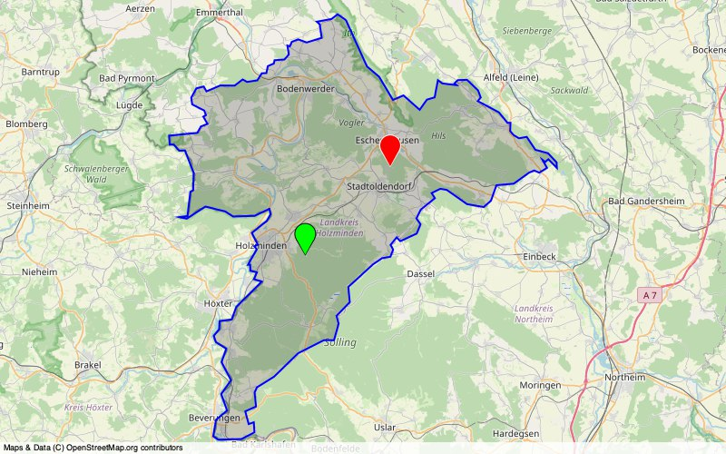

# mowas-pwb

 

## MOWAS Personal Warning Beacon

_Meet [KATWARN's](https://de.wikipedia.org/wiki/Katwarn) Open Source sibling_

``mowas-pwb`` is a [MOWAS](https://de.wikipedia.org/wiki/MoWaS) <b>P</b>ersonal <b>W</b>arning <b>B</b>eacon service which sends emergency broadcasts from Germany's 'Modulares Warnsystem' to [DAPNET](https://www.hampager.de), [Telegram](https://www.telegram.org/) and email accounts. You can install this program on platforms such as the Raspberry Pi and have it send you an alert in case an official warning message has been issued for your location(s).

``mowas-pwb`` has been created to complement the existing programs [KATWARN](https://de.wikipedia.org/wiki/Katwarn), [Nina](https://de.wikipedia.org/wiki/NINA_(App)) and [BIWAPP](https://de.wikipedia.org/wiki/BIWAPP) in order to enable additional communication channels such as mail, pager or Telegram messenger.

## Feature set

- Supports messaging to [Telegram](https://www.telegram.org/), Email and [DAPNET](https://www.hampager.de) accounts
- Monitors 1..n static lat/lon coordinates for [MOWAS](https://de.wikipedia.org/wiki/MoWaS) events
- Licensed ham radio amateurs can track their current [APRS](http://www.aprs.org/) position, too (_dynamic_ position monitoring)
- Users can specify a minimal warning level which needs to be met by a [MOWAS](https://de.wikipedia.org/wiki/MoWaS) event for triggering alerts.
- Emergency alerts can be sent to [DAPNET](https://www.hampager.de) users with high priority settings.
- In case of an emergency, ``mowas-pwb`` automatically switches to shorter 'emergency' run intervals. See [processing logic](docs/ADDITIONAL_INFO.md) for further details

:de: International users: ``mowas-pwb`` supports automatic translation of German [MOWAS](https://de.wikipedia.org/wiki/MoWaS) content into your native language.

## Supported MOWAS features

- Supports all current [MOWAS](https://de.wikipedia.org/wiki/MoWaS) categories (tempest, flood, wildfire, earthquake, emergency announcements)
- All [MOWAS](https://de.wikipedia.org/wiki/MoWaS) categories can be enabled or disabled in the program's configuration file
- You can easily add new [MOWAS](https://de.wikipedia.org/wiki/MoWaS) categories if they are made available through the official government feeds.

## Output examples

- [mowas-pwb Telegram message](docs/img/telegram.jpg)
- [mowas-pwb Mail message](docs/img/mail.jpg)

## Program details

- [Installation and Configuration](docs/INSTALLATION.md)
- [Supported Command Line Parameters](docs/COMMANDS.md)
- [Additional info on processing logic, known issues et al](docs/ADDITIONAL_INFO.md)
- [Legal information](docs/LEGAL.md)

## The fine print

- [APRS](http://www.aprs.org/) is a registered trademark of APRS Software and Bob Bruninga/WB4APR. Thank you Bob!
- [aprs.fi](http://www.aprs.fi/) services are provided by Heikki Hannikainen/OH7LZB - thank you Hessu!
- [MOWAS](https://de.wikipedia.org/wiki/MoWaS) feeds are provided by the [Bundesamt für Bevölkerungsschutz und Katastrophenhilfe](https://www.bbk.bund.de/)
